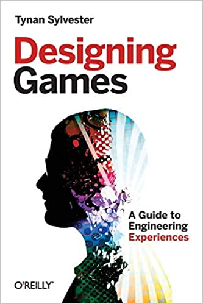

Lately I finished the "Designing Games", by Tynan Sylvester, lead developer of Rimworld.
Highly recommend to everyone who is interested in game design.
This book is not about the code, but about experience that your game will create.

<!-- end -->

Not sure if I have something to add to this short statement.
But I have some nice examples of author ideas he used in his games:

> _GAME DESIGN isn’t in code, art, or sound. It’s not in sculpting game pieces or painting game boards. Game design means crafting the rules that make those pieces come alive._

> _If you want a metaphor to use while thinking about games, don’t think of stories or movies. … Instead, think of a game as a strange kind of machine—an engine of experience._

And one of the best statements and paradoxes for the perfectionists out there:

> _In game design, temporarily accepting poor-quality work ultimately leads to better-quality work. This is the PARADOX OF QUALITY._
