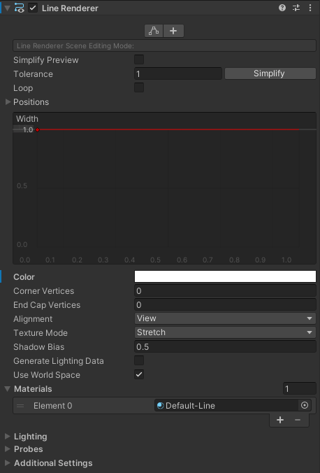

One of the challenging issues with in-game explosions - is to decide how you'll deal damage to the player.
First, it should be an area damage and regardless of the player's position he should receive damage (if he stays close enough).

<!-- end -->

Without the damage - explosion is only a cool visual effect, but there aren't many emotions attached to it.
It looks interesting, but it's not frightening:

<video autoPlay loop data-test="foo">
  <source src="explosion-without-damage.mp4" type="video/mp4" />
</video>

There are four aspects in a successful explosion:

1. It should go "BOOM" visually.
1. It should damage a careless player that stays too close to the epicenter.
1. Optionally it can show an explosion wave, so the player will learn what is the safe distance.
1. It should sound like an explosion.

In this post I will deal with the first 3.

First of all I need somehow to render a circle around the exploded object.
For that can be used the "Line Render" component.
All "Line Render" configurations I'm doing in code, the only thing I defined in the UI was Material.
I changed it to "Default-Line".



Next is to draw a growing circle around the game object. This is how I did it:

```typescript
private float _currentRadius;
private const int Segments = 36;
private const float LineWidth = 0.015f;

private void Start() {
  _lr = GetComponent<LineRenderer>();

  SetupExplosionWave();
}

private void FixedUpdate() {
  if (IsDestroyed()) {
    // I'm just increasing damage radius.
    // It will stop when object will be destroyed.
    _currentRadius += 8f * Time.deltaTime;
    DrawExplosionWave();
    if (IsPlayerInTheRadius()) {
      // Here is the logic to deal damage to the player
    }
  }
}

private bool IsPlayerInTheRadius() {
  var results = new Collider2D[1];
  var size = Physics2D.OverlapCircleNonAlloc(
    transform.position,
    _currentRadius,
    results,
    LayerMask.GetMask(ELayers.Player.ToString("g"))
  );
  return size > 0;
}

private void SetupExplosionWave() {
  var curve = new AnimationCurve();
  curve.AddKey(0.0f, LineWidth);
  _lr.widthCurve = curve;

  var waveColor = new Color(1f, 1f, 1f, 0.35f);

  _lr.startColor = waveColor;
  _lr.endColor = waveColor;
}

private void DrawExplosionWave() {
  var points = new Vector3[Segments + 1];
  var position = transform.position;
  for (var i = 0; i < Segments; i++) {
    var angle = ((float)i / (float)Segments) * 360 * Mathf.Deg2Rad;
    var x = Mathf.Sin(angle) * _currentRadius + position.x;
    var y = Mathf.Cos(angle) * _currentRadius + position.y;
    points[i] = new Vector3(x, y, 0);
  }

  points[Segments] = points[0];
  _lr.positionCount = points.Length;
  _lr.SetPositions(points);
}
```

The final result:

<video autoPlay loop>
  <source src="explosion-with-damage-wave.mp4" type="video/mp4" />
</video>
